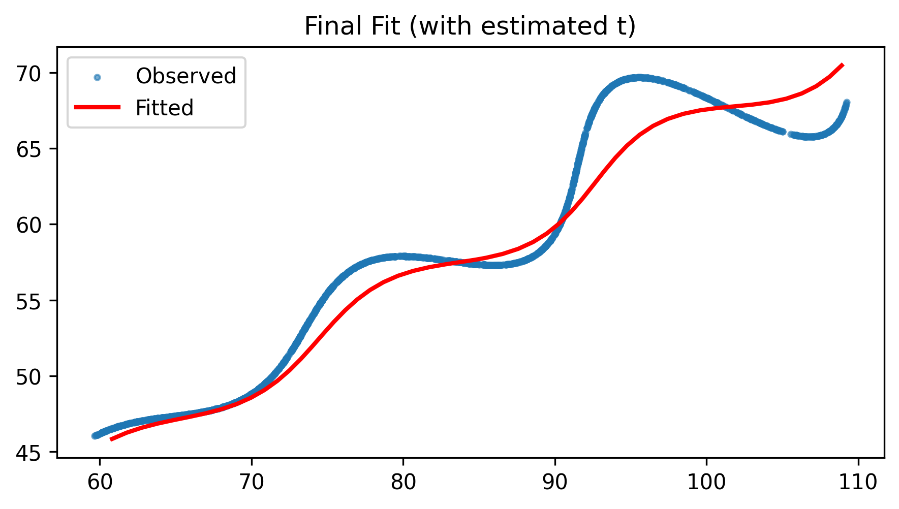
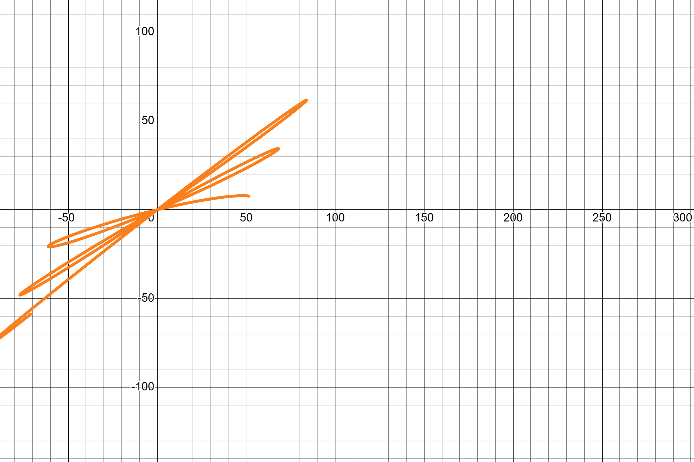

# Trajectory Fitting

This project performs parametric trajectory fitting with latent time estimation using alternating optimization.

## Description

The goal of this project is to fit a parametric model to a set of 2D data points (x, y). The model is defined by a set of parameters (theta, M, X) and a latent time variable `t`. The optimization is performed in an alternating fashion, first optimizing the model parameters and then the latent time variable.

## Installation

1.  Clone the repository:
    ```bash
    git clone https://github.com/abhishek4922/equation.git
    ```
2.  Install the dependencies:
    ```bash
    pip install -r requirements.txt
    ```
3.  Install the project in editable mode:
    ```bash
    pip install -e .
    ```

## Usage

To run the project, execute the `main.py` script:

```bash
python main.py
```

## Output

The script generates the following output files:

*   `outputs/fitted_params.txt`: The final optimized parameters (theta, M, X).
*   `outputs/fitted_with_t_estimates.csv`: The input data with the estimated latent time variable `t`.
*   `outputs/figures/final_fit.png`: A plot of the original data and the fitted model.
*   `outputs/equations/final_equation.txt`: The final optimized model equations.

## Equation

The final optimized model equations are:

```latex
x(t) = t \cos(\theta) - e^{M|t|} \sin(0.3t) \sin(\theta) + X
```

```latex
y(t) = 42.0 + t \sin(\theta) + e^{M|t|} \sin(0.3t) \cos(\theta)
```

With the following optimized parameters:

*   `theta` = 29.47°
*   `M` = 0.0078
*   `X` = 56.09

## Visualization




